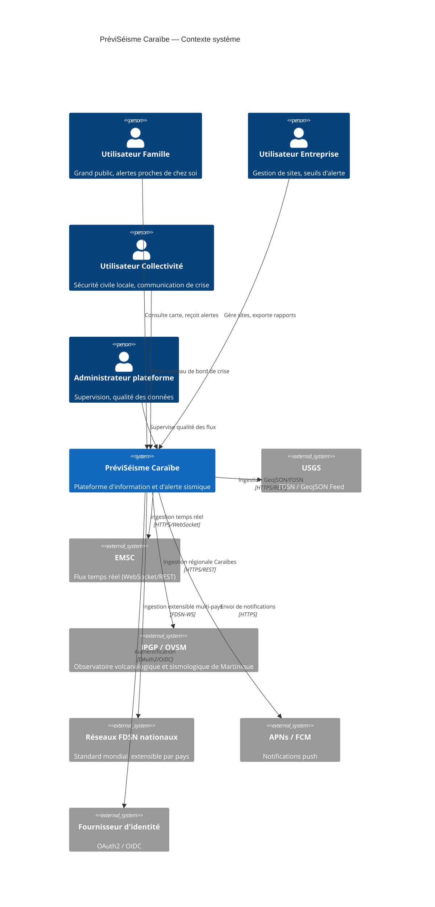
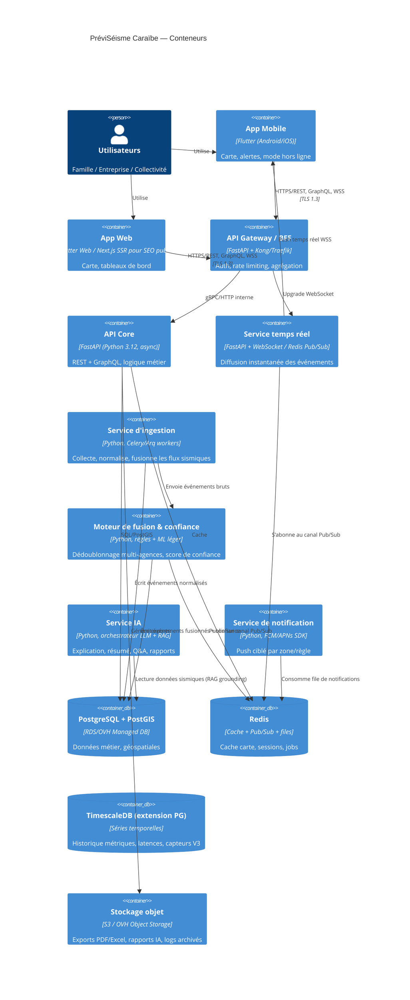
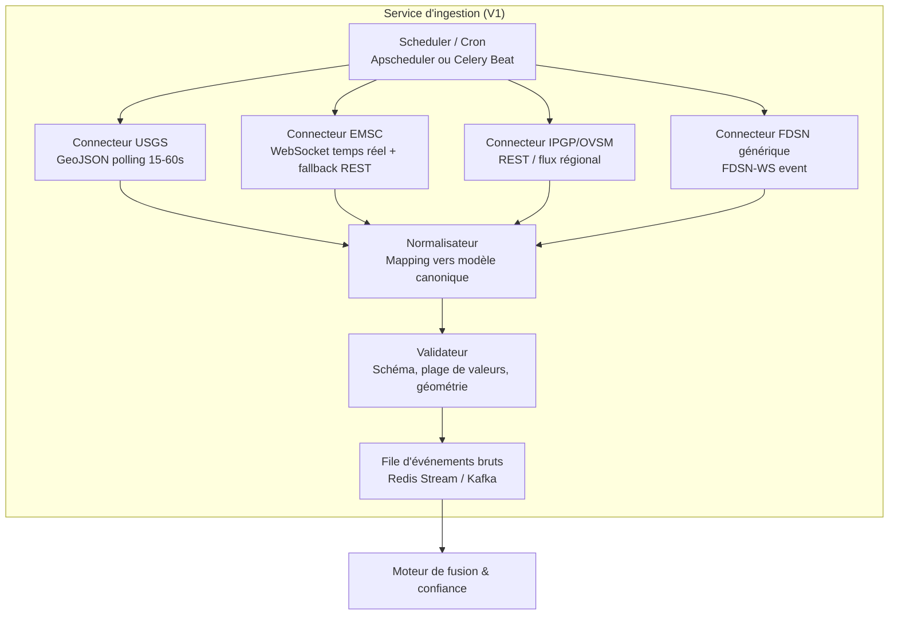
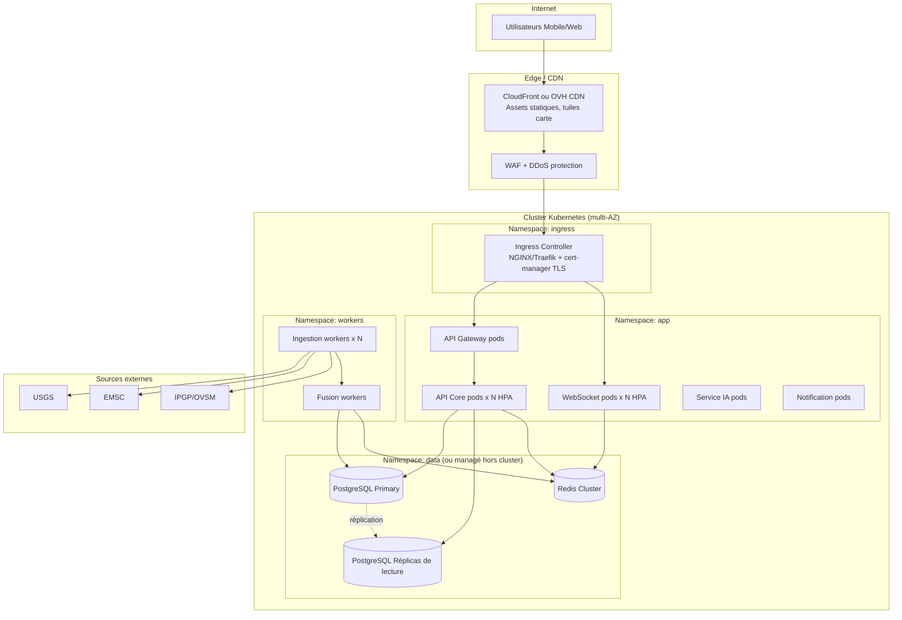

# 02 — Architecture système

## 2.1 Vue C4 — Niveau 1 : Contexte

**Principe clé** : la plateforme n'est jamais elle-même une "source" de données sismiques officielles — elle est un agrégateur, un moteur de fusion/qualité, et un canal de diffusion.

## 2.2 Vue C4 — Niveau 2 : Conteneurs

## 2.3 Vue C4 — Niveau 3 : Composants du Service d'ingestion (exemple)

## 2.4 Stack technique recommandée

| Couche | Technologie | Justification |
|---|---|---|
| Mobile/Web client | **Flutter 3.x** (Dart) | Un seul code pour Android/iOS/Web, performances natives, riche écosystème carte (`flutter_map`, `mapbox_gl`) |
| Rendu carte | MapLibre GL / Mapbox GL, tuiles vectorielles | Perf sur mobile, 3D en V3 (tilt, extrusion) |
| API Gateway | **Kong** ou **Traefik** | Rate limiting, auth centralisée, observabilité |
| Backend applicatif | **FastAPI** (Python 3.12, ASGI, Pydantic v2) | Async natif, perf proche de Node, typage fort, OpenAPI auto-généré |
| Workers asynchrones | **Celery** ou **Arq** + Redis | Ingestion planifiée, notifications, exports |
| Base de données | **PostgreSQL 16 + PostGIS 3.4** | Requêtes géospatiales (rayon, polygones de zones), standard éprouvé |
| Séries temporelles | **TimescaleDB** (extension PG) | Historique métriques capteurs, latences (V3) |
| Cache / Pub-Sub / files | **Redis 7** (Cluster) | Cache carte, diffusion temps réel, files de jobs |
| Temps réel | **WebSocket** (FastAPI + `redis pub/sub` ou NATS) | Latence faible pour la diffusion d'alertes |
| API publique | **REST** (OpenAPI 3.1) + **GraphQL** (Strawberry/Ariadne) | REST pour intégrations simples, GraphQL pour tableaux de bord riches |
| Authentification | **OAuth2 / OIDC** (Keycloak auto-hébergé ou AWS Cognito) + **JWT** courte durée + refresh tokens rotatifs | Standard, SSO entreprise possible |
| Conteneurisation | **Docker** + **Kubernetes** (EKS ou OVHcloud Managed Kubernetes) | Scalabilité, résilience multi-zone |
| IaC | **Terraform** + **Helm** | Reproductibilité, revue de code sur l'infra |
| CI/CD | **GitHub Actions** (build, tests, scan sécurité, déploiement progressif) | Intégré au dépôt, gratuit pour projets, écosystème riche |
| Observabilité | **Prometheus + Grafana**, **Loki** (logs), **OpenTelemetry** (traces) | Standard CNCF, corrélation métriques/logs/traces |
| IA | Orchestrateur RAG (LangChain/LlamaIndex ou custom léger) + API Claude (Anthropic) | Grounding strict sur données internes, pas de génération libre de faits sismiques |
| Cloud | **AWS** (option 1, écosystème mature, présence Caraïbes via `sa-east-1`/`us-east-1`) ou **OVHcloud** (option 2, souveraineté européenne/française, coût maîtrisé, pertinent pour DOM français) | Voir §2.6 arbitrage |

## 2.5 Vue déploiement (Kubernetes)

- **Multi-AZ obligatoire** : minimum 3 zones de disponibilité pour le cluster K8s et la base de données (réplication synchrone/quorum).
- **Multi-région en V2+** : réplication asynchrone vers une région secondaire (bascule PRA, voir doc 09).
- **Autoscaling horizontal (HPA)** sur les pods API/WebSocket selon CPU + nombre de connexions WebSocket actives.
- **Pods d'ingestion** isolés dans un namespace dédié avec quotas réseau (limite les risques de dépassement de quota API auprès des sources externes).

## 2.6 Arbitrage Cloud : AWS vs OVHcloud

| Critère | AWS | OVHcloud |
|---|---|---|
| Maturité services managés (K8s, RDS, SQS) | Très élevée | Bonne, en progression |
| Présence géographique proche Caraïbes | `us-east-1` (Virginie), latence correcte | Pas de région Caraïbes propre, mais bonne latence Europe/DOM via réseau France |
| Coût à l'échelle | Plus élevé, granularité fine | Généralement 30-40% moins cher à ressources égales |
| Souveraineté des données (utilisateurs DOM français) | Clauses contractuelles, mais droit US (Cloud Act) | Hébergement européen/français, argument fort pour collectivités et administrations |
| Écosystème IA managé | Bedrock, large choix de modèles | Plus limité, mais compatible avec API externes (Anthropic, etc.) |

**Recommandation** : démarrer sur **OVHcloud** pour les charges V1 (coût maîtrisé, argument souveraineté fort auprès des collectivités françaises des Caraïbes — Martinique, Guadeloupe), avec architecture **cloud-agnostique** (Kubernetes + Terraform + S3-compatible) permettant une bascule ou une répartition multi-cloud en V2/V3 si la couverture Haïti/République dominicaine/Porto Rico nécessite une latence optimisée via AWS `us-east-1`.

## 2.7 Principes d'architecture transverses

- **API-first** : toute fonctionnalité front consomme la même API publique documentée (dogfooding).
- **Idempotence** : chaque événement sismique ingéré porte un identifiant canonique stable (voir doc 04) pour permettre des ré-ingestions sans duplication.
- **Dégradation gracieuse** : si le service IA ou une source externe tombe, le cœur (carte + alertes officielles déjà fusionnées) continue de fonctionner.
- **Observabilité par défaut** : chaque requête porte un `trace_id` propagé de l'ingestion à la notification, pour mesurer la latence de bout en bout (donnée affichée à l'utilisateur, voir doc 07).
