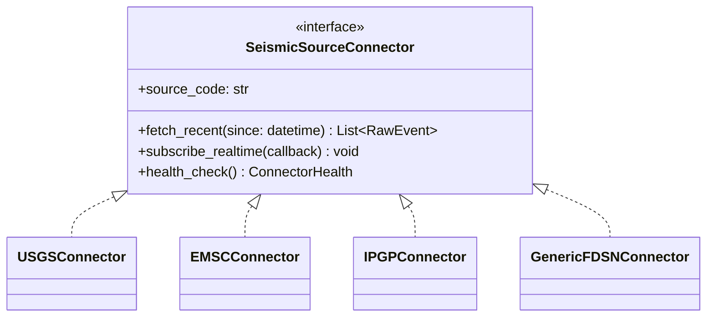
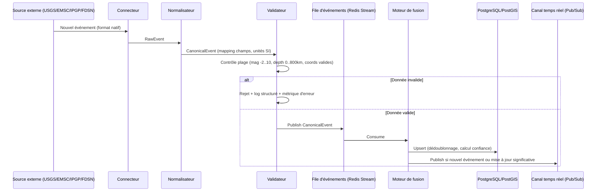

# 03 — Intégration des sources sismiques officielles

## 3.1 Principe d'architecture : le connecteur normalisé

Chaque source externe est intégrée via un **connecteur** respectant une interface commune (`SeismicSourceConnector`), produisant un événement au **format canonique interne** (doc 04 §4.2). Aucune logique métier (fusion, alerte) ne connaît le format natif d'une source — cela permet d'ajouter un nouvel observatoire national sans toucher au cœur de la plateforme.



Ajouter un observatoire national (ex. Guyana Geology and Mines Commission, Barbados Seismic Research Centre — UWI) revient à implémenter une nouvelle classe et l'enregistrer dans la configuration (`sources.yaml`), sans redéploiement du reste du système.

## 3.2 USGS — FDSN et GeoJSON

- **Flux GeoJSON temps réel** : `https://earthquake.usgs.gov/earthquakes/feed/v1.0/summary/{feed}.geojson` (feeds `significant`, `4.5`, `2.5`, `1.0`, `all`, fenêtres `hour`/`day`/`week`/`month`).
- **API FDSN Event Web Service** : `https://earthquake.usgs.gov/fdsnws/event/1/query` — requêtes paramétrées (bbox, magnitude min, plage temporelle), format `geojson`, `text`, `xml` (QuakeML).
- **Fréquence de polling recommandée V1** : 30 secondes sur le feed `all` filtré par bounding box Caraïbes (`minlatitude=8, maxlatitude=28, minlongitude=-90, maxlongitude=-58`), complété par le feed mondial `significant` à 60 secondes pour la carte mondiale.
- **Champs canoniques extraits** : `id`, `mag`, `magType`, `place`, `time`, `updated`, `coordinates` (lon/lat/depth), `status` (automatic/reviewed), `tsunami`, `felt`, `alert` (niveau PAGER si disponible), `url`.
- **Limites de service** : respecter les [conditions d'utilisation USGS](https://earthquake.usgs.gov/earthquakes/feed/) — pas de scraping HTML, uniquement les endpoints FDSN/GeoJSON documentés ; mise en cache locale pour éviter les appels redondants.

## 3.3 EMSC — European-Mediterranean Seismological Centre

- **Flux temps réel** : WebSocket EMSC (`wss://www.seismicportal.eu/standing_order/websocket`) diffusant chaque nouvel événement au format QuakeML/JSON dès sa publication — latence très faible (souvent < 2 minutes après l'événement).
- **API REST de secours** : service FDSN Event EMSC (`https://www.seismicportal.eu/fdsnws/event/1/query`) en cas de coupure WebSocket (reconnexion automatique avec backoff exponentiel + rattrapage via requête `starttime` depuis la dernière donnée reçue).
- **Valeur ajoutée EMSC** : couverture différente de l'USGS (réseau européen/méditerranéen mais aussi événements mondiaux relayés), utile pour la fusion et la validation croisée (doc 08).

## 3.4 IPGP / Observatoire Volcanologique et Sismologique de Martinique (OVSM)

- **IPGP** opère un réseau d'observatoires volcanologiques et sismologiques dans les Antilles françaises (OVSM en Martinique, OVSG en Guadeloupe).
- **Intégration recommandée** : contact direct avec l'IPGP pour un accès API/flux dédié (les observatoires IPGP publient des bulletins et parfois des flux structurés) ; à défaut d'API publique stable, prévoir un connecteur robuste au format disponible (RSS, page structurée, export CSV/QuakeML) avec **partenariat formel** pour un accès pérenne (voir doc 11).
- **Valeur ajoutée critique** : l'IPGP/OVSM est **la source de référence pour la sismicité locale fine** des Antilles françaises (magnitudes faibles, essaims sismiques locaux) que l'USGS/EMSC ne détectent pas toujours (seuil de détection mondial plus élevé). Source prioritaire pour la carte Caraïbes.
- **Gouvernance des données** : toute donnée IPGP affichée porte la mention "Source : IPGP/OVSM" et respecte les conditions de réutilisation définies avec l'observatoire (accord de partenariat, citation obligatoire).

## 3.5 FDSN — standard mondial, extensibilité multi-pays

Le **FDSN (International Federation of Digital Seismograph Networks)** définit les standards `FDSN Event Web Service` et `StationXML`/`QuakeML` utilisés par la majorité des observatoires nationaux (dont USGS, EMSC, et de nombreux réseaux nationaux : Porto Rico Seismic Network, Puerto Rico Strong Motion Program, Instituto Sismológico Universitario - République dominicaine, University of the West Indies Seismic Research Centre - Barbade/Petites Antilles anglophones, etc.).

**Fichier de configuration d'extensibilité** (`sources.yaml`), permettant d'ajouter un pays sans modification de code :

```yaml
sources:
  - code: usgs
    type: geojson_fdsn
    base_url: https://earthquake.usgs.gov
    poll_interval_seconds: 30
    bbox_default: [-90, 8, -58, 28]
    priority: 2
    licence: "Domaine public (USGS)"

  - code: emsc
    type: emsc_websocket
    ws_url: wss://www.seismicportal.eu/standing_order/websocket
    fallback_rest: https://www.seismicportal.eu/fdsnws/event/1/query
    priority: 2
    licence: "CC-BY EMSC"

  - code: ipgp_ovsm
    type: ipgp_custom
    base_url: https://www.ipgp.fr/ovsm
    region_scope: ["MTQ", "GLP"]  # Martinique, Guadeloupe
    priority: 1  # priorité la plus haute pour la zone Antilles françaises
    licence: "Convention IPGP — citation obligatoire"

  - code: pr_seismic_network   # exemple d'ajout futur — Porto Rico
    type: generic_fdsn
    base_url: https://redsismica.uprm.edu/fdsnws/event/1
    region_scope: ["PRI"]
    priority: 1

  - code: srp_uwi              # exemple d'ajout futur — UWI Seismic Research Centre
    type: generic_fdsn
    base_url: https://www.uwiseismic.com/fdsnws/event/1
    region_scope: ["BRB", "LCA", "VCT", "GRD", "DMA"]
    priority: 1
```

`priority` détermine l'ordre de préférence en cas de conflit lors de la fusion (doc 08) : une source locale à forte résolution (IPGP pour les Antilles françaises) prime sur une source mondiale pour les événements de sa zone de compétence.

## 3.6 Pipeline d'ingestion — vue d'ensemble



## 3.7 Gestion de la fraîcheur et de la panne d'une source

- **Health check périodique** par connecteur (latence, taux d'erreur, dernier événement reçu).
- **Statut affiché à l'utilisateur avancé (mode Entreprise/Collectivité)** : tableau "État des sources" (doc 07) — vert/jaune/rouge par source, avec horodatage du dernier événement reçu.
- **Bascule automatique** : si une source prioritaire (ex. IPGP) est en panne, le système continue avec les sources restantes et **abaisse temporairement l'indice de confiance affiché** pour les événements de la zone concernée (transparence, pas de masquage).
