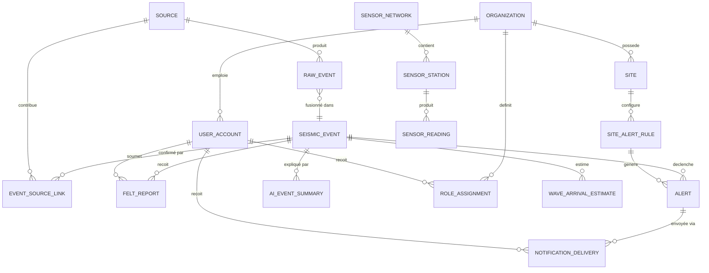

# 04 — Modèle de données et schéma de base de données

## 4.1 Diagramme entité-association (vue d'ensemble)



## 4.2 Modèle canonique d'événement (pivot du système)

Chaque événement, quelle que soit sa source, est normalisé vers ce modèle avant tout traitement métier :

```
CanonicalEvent
├── external_id            (identifiant natif de la source, ex. "us7000abcd")
├── source_code             (usgs | emsc | ipgp_ovsm | ...)
├── magnitude                (float)
├── magnitude_type           (Mw | ML | mb | Md ...)
├── location                 (Point géographique, SRID 4326)
├── depth_km                 (float)
├── place_description        (texte source, ex. "12 km SE of Le Vauclin, Martinique")
├── event_time_utc           (heure origine du séisme, telle que déterminée par la source)
├── source_detection_time_utc (heure à laquelle la source a publié/mis à jour l'événement)
├── ingestion_time_utc       (heure de réception par notre pipeline)
├── review_status            (automatic | reviewed | manual)
├── tsunami_flag             (bool, si fourni par la source)
└── raw_payload               (JSON brut conservé pour audit/traçabilité)
```

## 4.3 Schéma PostgreSQL / PostGIS (DDL)

```sql
-- Extensions requises
CREATE EXTENSION IF NOT EXISTS postgis;
CREATE EXTENSION IF NOT EXISTS "uuid-ossp";
CREATE EXTENSION IF NOT EXISTS timescaledb;  -- pour les tables de séries temporelles (V3)

-- =====================================================================
-- SOURCES ET DONNÉES BRUTES
-- =====================================================================

CREATE TABLE source (
    id                  SMALLSERIAL PRIMARY KEY,
    code                VARCHAR(32) UNIQUE NOT NULL,          -- 'usgs', 'emsc', 'ipgp_ovsm'
    name                VARCHAR(128) NOT NULL,
    connector_type      VARCHAR(32) NOT NULL,                 -- 'geojson_fdsn','emsc_websocket','generic_fdsn'
    licence             TEXT,
    priority            SMALLINT NOT NULL DEFAULT 5,          -- plus petit = plus prioritaire
    region_scope        VARCHAR(3)[] DEFAULT '{}',             -- codes ISO 3166-1 alpha-3
    base_url            TEXT,
    is_active           BOOLEAN NOT NULL DEFAULT true,
    created_at          TIMESTAMPTZ NOT NULL DEFAULT now()
);

CREATE TABLE source_health (
    source_id           SMALLINT REFERENCES source(id) ON DELETE CASCADE,
    checked_at           TIMESTAMPTZ NOT NULL,
    status               VARCHAR(16) NOT NULL,                -- 'ok','degraded','down'
    latency_ms           INTEGER,
    last_event_received_at TIMESTAMPTZ,
    error_message        TEXT,
    PRIMARY KEY (source_id, checked_at)
);

CREATE TABLE raw_event (
    id                   UUID PRIMARY KEY DEFAULT uuid_generate_v4(),
    source_id            SMALLINT NOT NULL REFERENCES source(id),
    external_id          VARCHAR(128) NOT NULL,
    magnitude            NUMERIC(3,1),
    magnitude_type       VARCHAR(8),
    location             GEOGRAPHY(POINT, 4326) NOT NULL,
    depth_km             NUMERIC(6,2),
    place_description    TEXT,
    event_time_utc       TIMESTAMPTZ NOT NULL,
    source_detection_time_utc TIMESTAMPTZ,
    ingestion_time_utc   TIMESTAMPTZ NOT NULL DEFAULT now(),
    review_status        VARCHAR(16) NOT NULL DEFAULT 'automatic', -- automatic|reviewed|manual
    tsunami_flag         BOOLEAN,
    raw_payload          JSONB NOT NULL,
    UNIQUE (source_id, external_id, source_detection_time_utc)
);
CREATE INDEX idx_raw_event_location ON raw_event USING GIST (location);
CREATE INDEX idx_raw_event_time ON raw_event (event_time_utc DESC);

-- =====================================================================
-- ÉVÉNEMENTS FUSIONNÉS (VÉRITÉ APPLICATIVE)
-- =====================================================================

CREATE TABLE seismic_event (
    id                    UUID PRIMARY KEY DEFAULT uuid_generate_v4(),
    canonical_magnitude   NUMERIC(3,1) NOT NULL,
    canonical_magnitude_type VARCHAR(8),
    canonical_location    GEOGRAPHY(POINT, 4326) NOT NULL,
    canonical_depth_km    NUMERIC(6,2),
    place_description     TEXT,
    country_iso3          VARCHAR(3),
    event_time_utc        TIMESTAMPTZ NOT NULL,
    first_detected_at_utc TIMESTAMPTZ NOT NULL,     -- 1ère détection toutes sources
    published_at_utc      TIMESTAMPTZ,               -- heure de diffusion aux utilisateurs
    confidence_score      NUMERIC(4,3) NOT NULL,      -- 0.000 à 1.000, voir doc 08
    confidence_label       VARCHAR(16) NOT NULL,       -- 'faible','moyen','élevé','confirmé_multi_source'
    review_status          VARCHAR(16) NOT NULL DEFAULT 'automatic',
    tsunami_flag            BOOLEAN NOT NULL DEFAULT false,
    is_duplicate_of         UUID REFERENCES seismic_event(id),  -- si détecté comme doublon a posteriori
    felt_report_count        INTEGER NOT NULL DEFAULT 0,
    created_at              TIMESTAMPTZ NOT NULL DEFAULT now(),
    updated_at               TIMESTAMPTZ NOT NULL DEFAULT now()
);
CREATE INDEX idx_seismic_event_location ON seismic_event USING GIST (canonical_location);
CREATE INDEX idx_seismic_event_time ON seismic_event (event_time_utc DESC);
CREATE INDEX idx_seismic_event_magnitude ON seismic_event (canonical_magnitude DESC);
CREATE INDEX idx_seismic_event_country ON seismic_event (country_iso3);

-- Table de liaison N-N : quelles sources confirment quel événement fusionné
CREATE TABLE event_source_link (
    seismic_event_id     UUID NOT NULL REFERENCES seismic_event(id) ON DELETE CASCADE,
    raw_event_id          UUID NOT NULL REFERENCES raw_event(id) ON DELETE CASCADE,
    source_id             SMALLINT NOT NULL REFERENCES source(id),
    match_score            NUMERIC(4,3),               -- score de correspondance temps/espace/magnitude
    is_primary_source       BOOLEAN NOT NULL DEFAULT false,
    PRIMARY KEY (seismic_event_id, raw_event_id)
);

-- =====================================================================
-- ORGANISATIONS, UTILISATEURS, RÔLES (V2)
-- =====================================================================

CREATE TABLE organization (
    id                    UUID PRIMARY KEY DEFAULT uuid_generate_v4(),
    name                   VARCHAR(256) NOT NULL,
    org_type               VARCHAR(16) NOT NULL,        -- 'famille','entreprise','collectivite'
    country_iso3            VARCHAR(3) NOT NULL,
    subscription_plan        VARCHAR(32) NOT NULL DEFAULT 'free',
    created_at               TIMESTAMPTZ NOT NULL DEFAULT now()
);

CREATE TABLE user_account (
    id                    UUID PRIMARY KEY DEFAULT uuid_generate_v4(),
    organization_id        UUID REFERENCES organization(id),
    email                   CITEXT UNIQUE NOT NULL,
    display_name             VARCHAR(128),
    locale                   VARCHAR(5) NOT NULL DEFAULT 'fr-FR', -- fr-FR | en-US | es-ES...
    home_location             GEOGRAPHY(POINT, 4326),
    oauth_subject             VARCHAR(256),               -- sub OIDC
    is_active                 BOOLEAN NOT NULL DEFAULT true,
    created_at                 TIMESTAMPTZ NOT NULL DEFAULT now()
);

CREATE TABLE role (
    id                    SMALLSERIAL PRIMARY KEY,
    code                   VARCHAR(32) UNIQUE NOT NULL   -- 'owner','admin','operator','viewer'
);

CREATE TABLE role_assignment (
    user_id               UUID NOT NULL REFERENCES user_account(id) ON DELETE CASCADE,
    organization_id        UUID NOT NULL REFERENCES organization(id) ON DELETE CASCADE,
    role_id                 SMALLINT NOT NULL REFERENCES role(id),
    granted_at               TIMESTAMPTZ NOT NULL DEFAULT now(),
    PRIMARY KEY (user_id, organization_id, role_id)
);

-- =====================================================================
-- SITES / BÂTIMENTS SURVEILLÉS (V2 — mode Entreprise/Collectivité)
-- =====================================================================

CREATE TABLE site (
    id                    UUID PRIMARY KEY DEFAULT uuid_generate_v4(),
    organization_id        UUID NOT NULL REFERENCES organization(id) ON DELETE CASCADE,
    name                    VARCHAR(256) NOT NULL,
    location                 GEOGRAPHY(POINT, 4326) NOT NULL,
    building_type              VARCHAR(64),               -- 'siege','usine','ecole','hopital'...
    occupancy_estimate            INTEGER,
    seismic_risk_zone              VARCHAR(16),            -- classement zonage sismique national
    created_at                       TIMESTAMPTZ NOT NULL DEFAULT now()
);
CREATE INDEX idx_site_location ON site USING GIST (location);

CREATE TABLE site_alert_rule (
    id                    UUID PRIMARY KEY DEFAULT uuid_generate_v4(),
    site_id                 UUID NOT NULL REFERENCES site(id) ON DELETE CASCADE,
    min_magnitude              NUMERIC(3,1) NOT NULL DEFAULT 3.0,
    max_distance_km              NUMERIC(6,1) NOT NULL DEFAULT 300,
    min_confidence_label            VARCHAR(16) NOT NULL DEFAULT 'moyen',
    notify_channels                  VARCHAR(16)[] NOT NULL DEFAULT '{push}', -- push|email|sms
    is_active                          BOOLEAN NOT NULL DEFAULT true
);

-- =====================================================================
-- ALERTES ET NOTIFICATIONS
-- =====================================================================

CREATE TABLE alert (
    id                    UUID PRIMARY KEY DEFAULT uuid_generate_v4(),
    seismic_event_id        UUID NOT NULL REFERENCES seismic_event(id),
    site_alert_rule_id        UUID REFERENCES site_alert_rule(id),   -- NULL si alerte grand public générique
    severity                    VARCHAR(16) NOT NULL,     -- 'info','vigilance','alerte'
    generated_at                  TIMESTAMPTZ NOT NULL DEFAULT now(),
    message_fr                      TEXT,
    message_en                       TEXT,
    message_es                        TEXT
);

CREATE TABLE notification_delivery (
    id                    UUID PRIMARY KEY DEFAULT uuid_generate_v4(),
    alert_id                UUID NOT NULL REFERENCES alert(id) ON DELETE CASCADE,
    user_id                    UUID NOT NULL REFERENCES user_account(id),
    channel                     VARCHAR(16) NOT NULL,       -- push|email|sms
    sent_at                       TIMESTAMPTZ,
    delivered_at                    TIMESTAMPTZ,
    acknowledged_at                   TIMESTAMPTZ,           -- accusé de réception (mode collectivité)
    delivery_latency_ms                 INTEGER,
    status                                VARCHAR(16) NOT NULL DEFAULT 'pending' -- pending|sent|delivered|failed
);
CREATE INDEX idx_notif_alert ON notification_delivery (alert_id);

-- =====================================================================
-- SIGNALEMENT CITOYEN "J'AI RESSENTI CE SÉISME"
-- =====================================================================

CREATE TABLE felt_report (
    id                    UUID PRIMARY KEY DEFAULT uuid_generate_v4(),
    seismic_event_id        UUID REFERENCES seismic_event(id),  -- NULL si non rattaché automatiquement
    user_id                    UUID REFERENCES user_account(id),
    reported_location            GEOGRAPHY(POINT, 4326) NOT NULL,
    intensity_perceived              SMALLINT,             -- échelle EMS-98 / MMI simplifiée 1-12
    submitted_at                       TIMESTAMPTZ NOT NULL DEFAULT now(),
    free_text_comment                    TEXT
);
CREATE INDEX idx_felt_report_event ON felt_report (seismic_event_id);
CREATE INDEX idx_felt_report_location ON felt_report USING GIST (reported_location);

-- =====================================================================
-- IA : RÉSUMÉS ET RAPPORTS (V1/V2 explicatif — V3 estimation d'impact)
-- =====================================================================

CREATE TABLE ai_event_summary (
    id                    UUID PRIMARY KEY DEFAULT uuid_generate_v4(),
    seismic_event_id        UUID NOT NULL REFERENCES seismic_event(id) ON DELETE CASCADE,
    locale                     VARCHAR(5) NOT NULL,
    summary_text                 TEXT NOT NULL,
    model_identifier                VARCHAR(64) NOT NULL,
    grounding_source_ids               UUID[] NOT NULL,    -- raw_event.id utilisés comme source (RAG)
    generated_at                         TIMESTAMPTZ NOT NULL DEFAULT now(),
    human_reviewed                         BOOLEAN NOT NULL DEFAULT false
);

-- =====================================================================
-- RÉSEAUX DE CAPTEURS (V3)
-- =====================================================================

CREATE TABLE sensor_network (
    id                    UUID PRIMARY KEY DEFAULT uuid_generate_v4(),
    name                    VARCHAR(128) NOT NULL,
    operator_organization     VARCHAR(256),
    partnership_status          VARCHAR(32) NOT NULL DEFAULT 'evaluation' -- evaluation|active|suspended
);

CREATE TABLE sensor_station (
    id                    UUID PRIMARY KEY DEFAULT uuid_generate_v4(),
    sensor_network_id        UUID NOT NULL REFERENCES sensor_network(id) ON DELETE CASCADE,
    station_code                VARCHAR(32) NOT NULL,
    location                       GEOGRAPHY(POINT, 4326) NOT NULL,
    elevation_m                     NUMERIC(6,1),
    is_active                         BOOLEAN NOT NULL DEFAULT true
);
CREATE INDEX idx_sensor_station_location ON sensor_station USING GIST (location);

-- Table de séries temporelles (hypertable Timescale) pour les mesures P/S
CREATE TABLE sensor_reading (
    time                  TIMESTAMPTZ NOT NULL,
    sensor_station_id        UUID NOT NULL REFERENCES sensor_station(id),
    channel                     VARCHAR(8) NOT NULL,        -- ex: 'HHZ','HHN','HHE'
    p_wave_detected                BOOLEAN,
    amplitude                        DOUBLE PRECISION,
    raw_sample_ref                     TEXT                 -- pointeur vers stockage objet (miniSEED)
);
SELECT create_hypertable('sensor_reading', 'time');

CREATE TABLE wave_arrival_estimate (
    id                    UUID PRIMARY KEY DEFAULT uuid_generate_v4(),
    seismic_event_id        UUID NOT NULL REFERENCES seismic_event(id) ON DELETE CASCADE,
    target_location            GEOGRAPHY(POINT, 4326) NOT NULL,  -- ville/site cible
    estimated_p_wave_arrival_utc  TIMESTAMPTZ,
    estimated_s_wave_arrival_utc    TIMESTAMPTZ,
    estimated_lead_time_seconds        NUMERIC(6,1),         -- délai estimé avant ondes S
    model_version                        VARCHAR(32) NOT NULL,
    is_experimental                         BOOLEAN NOT NULL DEFAULT true  -- toujours true hors validation V3 certifiée
);

-- =====================================================================
-- AUDIT ET JOURNALISATION APPLICATIVE (complète le logging infra, doc 09)
-- =====================================================================

CREATE TABLE audit_log (
    id                    BIGSERIAL PRIMARY KEY,
    occurred_at              TIMESTAMPTZ NOT NULL DEFAULT now(),
    actor_user_id               UUID REFERENCES user_account(id),
    action                        VARCHAR(64) NOT NULL,     -- 'export_pdf','role_change','alert_rule_update'...
    entity_type                    VARCHAR(64),
    entity_id                        UUID,
    metadata                          JSONB
);
CREATE INDEX idx_audit_log_time ON audit_log (occurred_at DESC);
```

## 4.4 Notes de conception

- **`GEOGRAPHY` plutôt que `GEOMETRY`** : calculs de distance en mètres directement corrects sur la sphère terrestre (important vu l'étendue Caraïbes/mondiale), au prix d'un léger surcoût CPU — acceptable au vu des volumes (dizaines de milliers d'événements/an, pas de millions).
- **Séparation `raw_event` / `seismic_event`** : jamais de perte d'information brute (traçabilité, audit, ré-analyse), séparée de la "vérité applicative" fusionnée exposée aux utilisateurs.
- **`is_experimental` par défaut `true`** sur `wave_arrival_estimate` : garde-fou explicite tant que le module V3 n'est pas validé scientifiquement (doc 11) — empêche qu'une estimation interne soit un jour affichée comme certaine par erreur de configuration front.
- **Partitionnement** : `raw_event` et `audit_log` doivent être partitionnés par mois (partitionnement déclaratif PostgreSQL) au-delà de quelques millions de lignes pour maintenir les performances d'index.
- **Rétention** : `raw_payload` (JSONB volumineux) archivé vers stockage objet au-delà de 12 mois, avec pointeur conservé en base (coût de stockage BDD maîtrisé).
