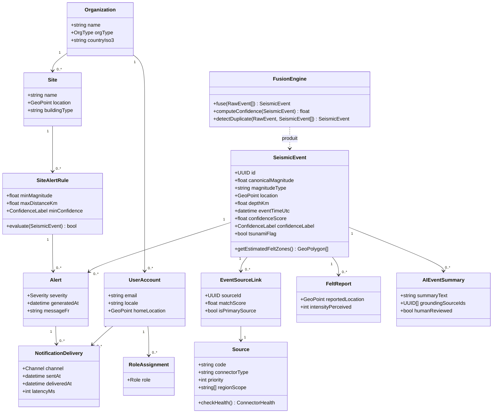
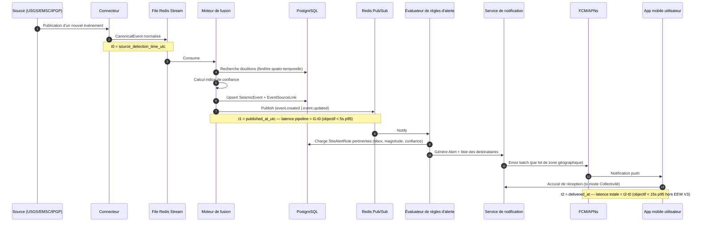
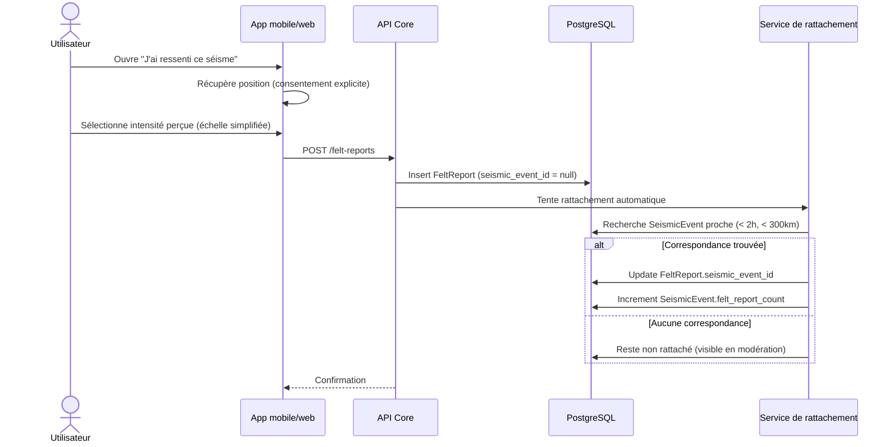
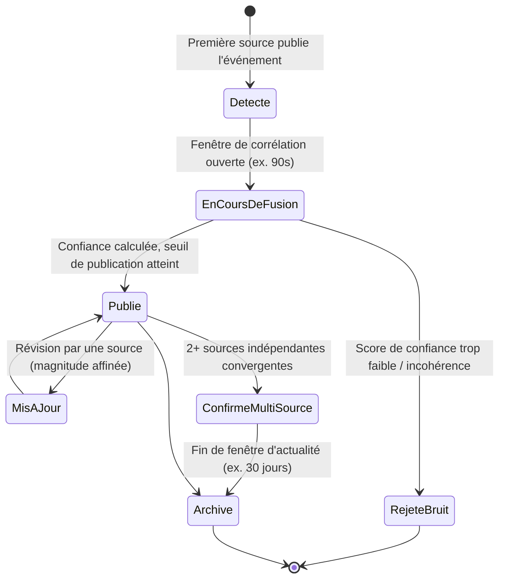
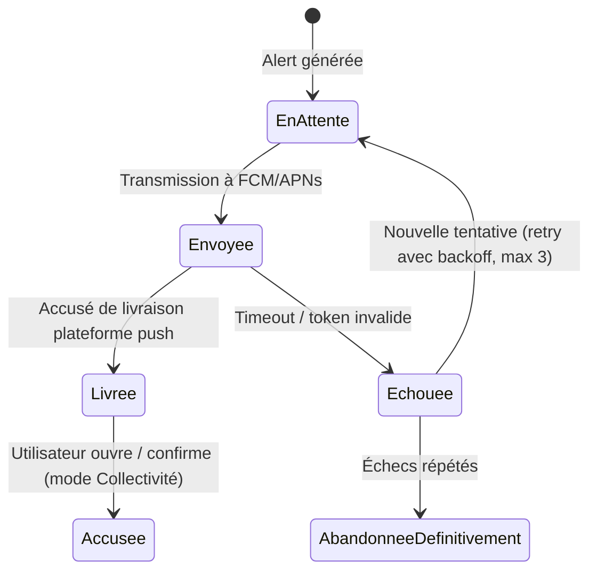

# 05 — Diagrammes UML

## 5.1 Diagramme de classes — Domaine métier (cœur V1/V2)



## 5.2 Diagramme de séquence — Ingestion → Fusion → Alerte → Notification (chemin critique de latence)



## 5.3 Diagramme de séquence — Signalement citoyen « J'ai ressenti ce séisme »



## 5.4 Diagramme d'état — Cycle de vie d'un événement sismique



## 5.5 Diagramme d'état — Statut d'une notification



## 5.6 Diagramme de composants — Modules Flutter (client)

```mermaid
flowchart LR
    subgraph FlutterApp["Application Flutter (Android/iOS/Web)"]
        MAP[Module Carte\nMapLibre/Mapbox]
        FEED[Module Fil d'actualité sismique]
        FILTERS[Module Filtres\nmagnitude/distance/profondeur]
        SEARCH[Module Recherche\npays/ville]
        ALERTS[Module Alertes & Notifications]
        OFFLINE[Module Cache hors-ligne\nsqlite/drift]
        SAFETY[Module Consignes de sécurité]
        FELT[Module "J'ai ressenti"]
        STATS[Module Statistiques]
        AI_CHAT[Module Assistant IA]
        DASH_ENT[Module Tableau de bord Entreprise]
        DASH_COL[Module Tableau de bord Collectivité]
        AUTH[Module Authentification OAuth2/JWT]
        I18N[Module i18n FR/EN/ES]
    end
    API[(API Gateway)]
    MAP --> API
    FEED --> API
    ALERTS --> API
    SEARCH --> API
    FELT --> API
    AI_CHAT --> API
    DASH_ENT --> API
    DASH_COL --> API
    AUTH --> API
    OFFLINE -. sync .-> API
```
