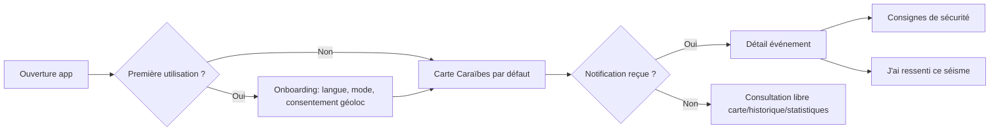
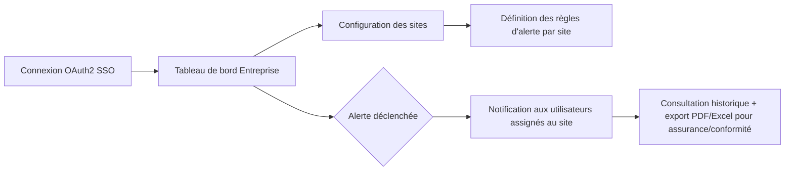

# 07 — UX, écrans et maquettes

## 7.1 Inventaire des écrans (V1)

| # | Écran | Objectif |
|---|---|---|
| 1 | Onboarding / choix du mode | Sélection Famille / Entreprise / Collectivité, langue, consentement géolocalisation |
| 2 | Carte mondiale | Vue globale des séismes récents, clustering par zoom |
| 3 | Carte Caraïbes | Vue régionale par défaut pour les utilisateurs de la zone, zonage volcanique/sismique |
| 4 | Détail d'un événement | Magnitude, profondeur, sources, indice de confiance, carte locale, bouton "J'ai ressenti" |
| 5 | Fil d'actualité sismique | Liste chronologique filtrable |
| 6 | Filtres | Magnitude / distance / profondeur / confiance |
| 7 | Recherche pays/ville | Autocomplete, résultats avec derniers événements |
| 8 | Historique | Recherche dans le passé, export (V2) |
| 9 | Statistiques | Graphiques fréquence, répartition par zone/magnitude |
| 10 | Consignes de sécurité | Contenus officiels par pays/langue |
| 11 | Signalement "J'ai ressenti" | Formulaire localisation + intensité + commentaire |
| 12 | Notifications / centre d'alertes | Historique des alertes reçues |
| 13 | Paramètres | Langue, zones surveillées, seuils de notification personnels |
| 14 | Mode hors ligne | Bannière d'état + dernières données en cache |
| 15 | État des sources (avancé) | Statut USGS/EMSC/IPGP en temps réel |

## 7.2 Écrans additionnels V2

| # | Écran | Mode |
|---|---|---|
| 16 | Tableau de bord Collectivité | Collectivité |
| 17 | Tableau de bord Entreprise | Entreprise |
| 18 | Gestion des sites/bâtiments | Entreprise/Collectivité |
| 19 | Gestion des utilisateurs et rôles | Entreprise/Collectivité |
| 20 | Configuration des règles d'alerte par site | Entreprise/Collectivité |
| 21 | Export PDF/Excel | Entreprise/Collectivité |
| 22 | Portail API publique (clés, quotas) | Développeur |

## 7.3 Écrans additionnels V3

| # | Écran | Contenu |
|---|---|---|
| 23 | Carte 3D de propagation des ondes | Animation temporelle, front d'onde P/S |
| 24 | Simulation d'impact | Zones à risque estimé, avec avertissement "estimation, non certifiée" |
| 25 | Carte des capteurs | Position, statut, dernière mesure |

## 7.4 Wireframe — Détail d'un événement (V1)

```
┌─────────────────────────────────────────────┐
│ ←  Séisme M 5.2 — 12 km SE Le Vauclin (MTQ)  │
├─────────────────────────────────────────────┤
│  [ Mini-carte centrée sur l'épicentre ]      │
│                                               │
│  Magnitude        5.2 Mw                     │
│  Profondeur       28 km                      │
│  Heure locale      01/07/2026 14:32 (AST)    │
│  Heure origine (UTC) 18:32:05                │
│                                               │
│  ● Indice de confiance : ÉLEVÉ                │
│    Confirmé par 2 sources : IPGP/OVSM, USGS   │
│    [i] Qu'est-ce que l'indice de confiance ?  │
│                                               │
│  Détecté à 18:32:41 UTC (36s après l'origine) │
│  Diffusé à     18:32:47 UTC (latence 6s)      │
│                                               │
│  Ressenti par 142 personnes  [Voir la carte]  │
│  [🔘 J'ai ressenti ce séisme]                 │
│                                               │
│  [Résumé IA ▾]                                │
│  "Ce séisme modéré s'est produit au large de  │
│  la côte atlantique de la Martinique. Aucune  │
│  alerte tsunami n'a été émise par les sources │
│  officielles. — Généré par IA, basé sur les   │
│  données IPGP/OVSM et USGS. Non un avis        │
│  d'expert humain."                             │
│                                                │
│  Consignes de sécurité officielles →           │
│  Source : IPGP/OVSM · USGS  [Voir données brutes]│
└─────────────────────────────────────────────┘
```

Principes appliqués : la provenance et le délai sont **toujours visibles**, le résumé IA est **explicitement étiqueté** et distingué visuellement (encadré, mention de non-expertise humaine), l'action de sécurité civile est **un lien externe vers l'autorité**, jamais un contenu réécrit par l'application.

## 7.5 Wireframe — Tableau de bord Collectivité (V2)

```
┌───────────────────────────────────────────────────────────┐
│ PréviSéisme Caraïbe — Collectivité de [Nom]                │
├───────────────────────────────────────────────────────────┤
│ Alertes actives (3)        │ Carte du territoire           │
│ ┌─────────────────────┐    │ ┌───────────────────────────┐ │
│ │ M4.8 - il y a 12 min │    │ │  [carte avec sites +       │ │
│ │ Confiance: ÉLEVÉ     │    │ │   épicentres + isoséismes] │ │
│ │ 84% accusés reçus    │    │ └───────────────────────────┘ │
│ └─────────────────────┘    │                                │
│                             │ État des sources: 🟢🟢🟡        │
│ Sites surveillés: 24        │ Bâtiments en zone d'alerte: 6  │
│ [Gérer les sites]           │ [Voir détail]                  │
│                             │                                │
│ [Exporter PDF] [Exporter Excel] [Historique des alertes]    │
└───────────────────────────────────────────────────────────┘
```

## 7.6 Parcours utilisateur — Mode Famille (V1)



## 7.7 Parcours utilisateur — Mode Entreprise (V2)



## 7.8 Charte UX transverse

- **Hiérarchie visuelle de la confiance** : code couleur constant (rouge = confirmé multi-source haute magnitude, orange = confiance moyenne, gris = automatique non revu) appliqué partout (carte, liste, détail).
- **Aucune donnée sans provenance visible** : chaque écran affichant une donnée sismique affiche le nom de la ou des sources en pied de carte ou de carte-événement.
- **Accessibilité** : conformité WCAG 2.2 AA (contraste, taille de cible tactile ≥ 44px, support lecteur d'écran VoiceOver/TalkBack, mode "vibration + son" configurable pour alertes en situation de handicap auditif/visuel).
- **Mode hors ligne visible** : bannière persistante "Dernière mise à jour : il y a 42 min (hors ligne)" plutôt qu'un état silencieusement périmé.
- **i18n** : FR/EN/ES avec bascule immédiate, contenus de sécurité traduits et validés (pas de traduction automatique pour les consignes de sécurité officielles — traduction humaine certifiée).
