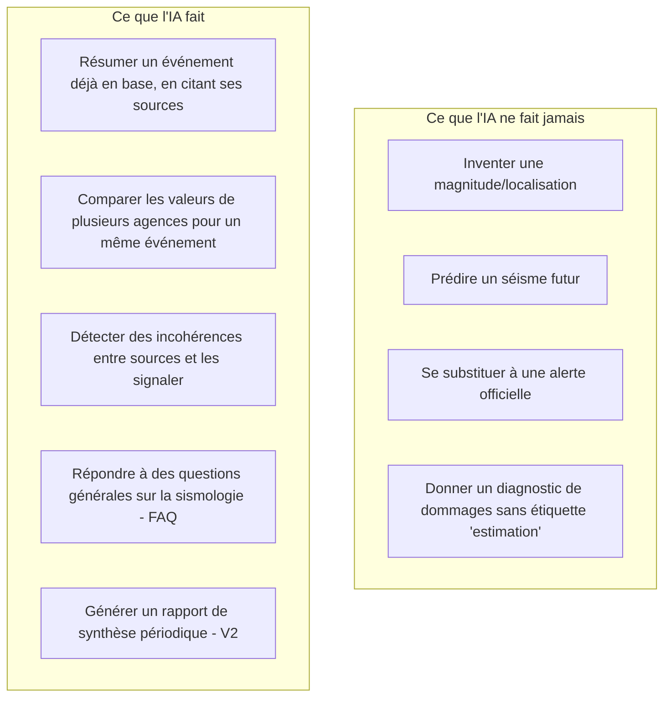
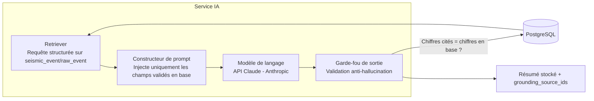

# 08 — Intelligence artificielle

## 8.1 Rôle de l'IA dans la plateforme — et ses limites strictes

L'IA de PréviSéisme Caraïbe a un rôle **d'aide à l'interprétation et à la communication**, jamais de source de vérité sismologique. Elle opère selon un principe de **grounding strict** : toute affirmation factuelle (magnitude, localisation, heure) doit être directement extraite des données `raw_event`/`seismic_event` déjà validées par le pipeline d'ingestion — jamais générée librement par un modèle de langage.



## 8.2 Fusion multi-agences, détection de doublons, indice de confiance (V2)

### 8.2.1 Algorithme de rapprochement (déterministe, pas de "boîte noire")

Le rapprochement entre événements de sources différentes est un algorithme **déterministe et explicable**, pas un modèle opaque, car il alimente une donnée affichée comme fait (indice de confiance) :

```
Pour un nouvel événement E (source S) :
  candidats = SeismicEvent où
      |E.event_time_utc - candidat.event_time_utc| < 120 secondes
      ET distance(E.location, candidat.location) < max(50km, 2 * incertitude_typique(S))
      ET |E.magnitude - candidat.magnitude| < 1.0

  si candidats non vide:
      meilleur = candidat avec le plus haut match_score
      match_score = pondération(Δt, Δdistance, Δmagnitude)
      rattacher E à meilleur (EventSourceLink)
  sinon:
      créer un nouveau SeismicEvent à partir de E
```

### 8.2.2 Indice de confiance

Le score de confiance (0 à 1, stocké dans `seismic_event.confidence_score`) est un **calcul de règles pondérées**, entièrement traçable et affichable à l'utilisateur avancé (mode "Voir le détail du calcul") :

| Facteur | Poids | Détail |
|---|---|---|
| Nombre de sources indépendantes confirmant | 40% | 1 source = base, 2 sources = +25pts, 3+ = +40pts |
| Statut de revue (automatic vs reviewed) | 25% | `reviewed` par un sismologue humain de la source = score plein |
| Cohérence inter-sources (Δmagnitude, Δlocalisation) | 20% | Fort écart entre sources = pénalité |
| Présence d'une source locale à haute résolution (ex. IPGP pour Antilles françaises) | 10% | Bonus si source prioritaire régionale confirme |
| Signalements citoyens cohérents avec la localisation | 5% | Signal faible, jamais suffisant seul |

**Étiquettes** : `faible` (<0.4), `moyen` (0.4–0.65), `élevé` (0.65–0.85), `confirmé_multi_source` (>0.85, ≥2 sources indépendantes + reviewed).

**Garde-fou** : un événement à confiance `faible` reste affiché (transparence) mais n'est **jamais** utilisé seul pour déclencher une notification push à large échelle (seuil configurable par organisation, défaut = `moyen` minimum pour push).

### 8.2.3 Détection d'incohérences (rôle de l'IA ici)

Une fois le rapprochement déterministe effectué, un modèle de langage **assisté par les règles ci-dessus** (jamais l'inverse) peut être utilisé pour formuler en langage naturel les incohérences détectées, par exemple : *"USGS reporte une magnitude de 5.4 Mw tandis qu'EMSC reporte 5.1 Mw pour cet événement — écart dans la marge d'incertitude habituelle entre agences."* — texte généré **à partir des chiffres déjà calculés**, jamais en réinterprétant les données brutes de façon autonome.

## 8.3 Architecture du service IA



**Garde-fou de sortie (`GUARD`)** : avant stockage, un contrôle automatique extrait tout nombre/valeur cité dans le texte généré (magnitude, profondeur, dates) et vérifie sa correspondance exacte avec les champs de `seismic_event`/`raw_event` ayant servi de contexte. Toute divergence rejette la génération et déclenche une nouvelle tentative avec prompt renforcé ; au-delà de N échecs, un texte générique de repli est utilisé ("Résumé indisponible, consultez les données officielles ci-dessous") plutôt que de publier une sortie non vérifiée.

## 8.4 Assistant conversationnel (Q&A utilisateurs)

- **RAG strict** : chaque réponse à une question utilisateur ("Ce séisme est-il dangereux pour ma maison ?") est construite en récupérant les événements et consignes de sécurité officielles pertinents, puis en demandant au modèle de répondre **uniquement à partir de ce contexte**, avec citation des sources.
- **Refus explicite hors périmètre** : pour toute question de prédiction ("Y aura-t-il un séisme demain ?"), l'assistant répond par un message standard expliquant que la prédiction sismique déterministe n'est pas possible scientifiquement, et redirige vers les statistiques de sismicité historique de la zone.
- **Escalade humaine** : pour les questions sensibles (dommages structurels, décisions d'évacuation), l'assistant redirige systématiquement vers les autorités compétentes et les numéros d'urgence locaux, sans jamais donner de consigne de sécurité générée de novo.

## 8.5 Rapports automatiques (V2)

- Génération périodique (hebdomadaire/mensuelle) de rapports de synthèse pour les collectivités/entreprises : nombre d'événements, répartition par magnitude/zone, alertes envoyées, taux d'accusé de réception.
- **Toutes les statistiques du rapport sont calculées par des requêtes SQL déterministes** ; l'IA n'intervient que pour la mise en forme narrative du texte d'introduction, avec les mêmes garde-fous qu'en 8.3.
- Chaque rapport porte la mention : *"Rapport généré automatiquement à partir des données [USGS, EMSC, IPGP/OVSM]. Section narrative assistée par IA, relecture humaine recommandée avant diffusion externe."*

## 8.6 Estimation de zones à risque et de dommages (V3 — cadre renforcé)

Ce module est le plus sensible : il produit des **estimations probabilistes**, pas des mesures.

- Utilisation de modèles d'atténuation sismique reconnus (ex. GMPE — Ground Motion Prediction Equations publiées scientifiquement), pas de modèle "IA boîte noire" pour l'estimation physique elle-même.
- L'IA générative peut être utilisée pour **traduire en langage clair** une sortie de modèle GMPE déjà calculée ("Intensité estimée modérée dans un rayon de 15 km"), jamais pour produire elle-même le chiffre d'intensité.
- Toute sortie de ce module porte visuellement et textuellement la mention **"Estimation non certifiée — à ne pas utiliser pour une décision de sécurité opérationnelle"** jusqu'à validation scientifique indépendante (voir doc 11).
- **Interdiction produit explicite** : ce module ne peut pas être activé en production grand public sans revue par un comité scientifique externe (sismologues partenaires) — c'est une porte de configuration (feature flag) contrôlée au niveau organisationnel, pas seulement applicatif.

## 8.7 Journalisation et audit spécifiques à l'IA

- Chaque génération IA est journalisée avec : prompt final envoyé, contexte de grounding (`grounding_source_ids`), réponse brute du modèle, résultat du garde-fou, identifiant de version du modèle.
- Objectif : toute sortie IA doit pouvoir être **auditée a posteriori** (qui a vu quoi, à partir de quelles données, avec quel modèle) — exigence de traçabilité alignée avec le principe fondateur "aucune donnée inventée" (doc 01).
