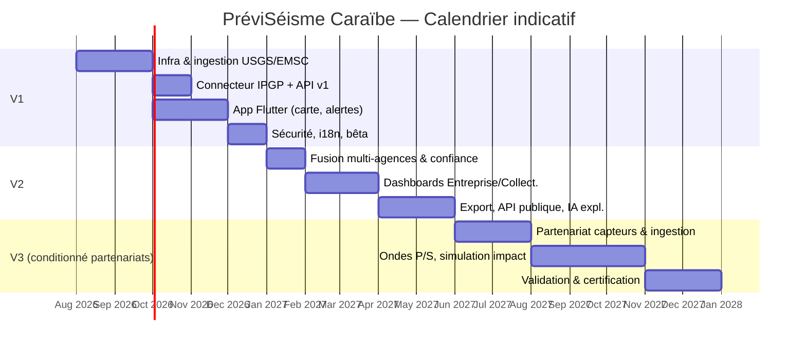

# 10 — Plan projet : sprints, budget, calendrier, risques

> Les chiffres de budget et de délai ci-dessous sont des **ordres de grandeur indicatifs** pour cadrer une décision de lancement, basés sur des équipes types du marché (taux journaliers moyens Europe/France 2026). Ils doivent être affinés par un chiffrage détaillé (devis prestataires ou coûts internes réels) avant tout engagement contractuel.

## 10.1 Équipe cible

| Rôle | V1 | V2 | V3 |
|---|---|---|---|
| Chef de projet / Product Owner | 1 | 1 | 1 |
| Architecte logiciel | 0.5 | 0.5 | 1 |
| Développeurs backend (FastAPI/Python) | 2 | 3 | 3 |
| Développeurs Flutter (mobile+web) | 2 | 2 | 2 |
| Ingénieur DevOps/SRE | 1 | 1 | 1.5 |
| Data/IA engineer | 0.5 | 1 | 2 |
| Sismologue conseil (partenariat/consultation) | 0.5 | 0.5 | 1 |
| UX/UI designer | 1 | 0.5 | 0.5 |
| QA / testeur | 1 | 1 | 1 |
| RSSI / consultant sécurité (ponctuel) | 0.2 | 0.3 | 0.3 |

## 10.2 Roadmap et découpage en sprints (sprints de 2 semaines)

### Phase V1 (Sprints 1 à 12 — environ 6 mois)

| Sprint | Contenu |
|---|---|
| S1-S2 | Cadrage technique, mise en place infra (K8s, CI/CD, Terraform), schéma BDD initial |
| S3-S4 | Connecteurs USGS + EMSC, pipeline d'ingestion de base, tests avec rejeu historique |
| S5-S6 | Connecteur IPGP/OVSM (démarrage discussions partenariat), modèle canonique, API REST v1 (lecture) |
| S7-S8 | App Flutter : carte mondiale + Caraïbes, détail événement, filtres |
| S9 | Notifications push (FCM/APNs), mode hors ligne |
| S10 | Signalement "J'ai ressenti", statistiques, historique |
| S11 | Consignes de sécurité, i18n FR/EN/ES, accessibilité |
| S12 | Durcissement sécurité, tests de charge initiaux, bêta fermée, correctifs |

**Jalon V1** : lancement bêta publique Martinique/Guadeloupe, puis extension Caraïbes élargie.

### Phase V2 (Sprints 13 à 22 — environ 5 mois)

| Sprint | Contenu |
|---|---|
| S13-S14 | Moteur de fusion multi-agences, indice de confiance, dédoublonnage |
| S15-S16 | Modèle multi-organisation (RBAC), tableau de bord Entreprise |
| S17-S18 | Tableau de bord Collectivité, gestion des sites/bâtiments, règles d'alerte par site |
| S19 | Exports PDF/Excel, historique des alertes/accusés |
| S20-S21 | API publique (portail développeur, quotas, GraphQL) |
| S22 | IA : résumés explicatifs, rapports automatiques, garde-fous anti-hallucination, durcissement |

**Jalon V2** : premiers contrats Entreprise/Collectivité, API publique en accès contrôlé.

### Phase V3 (Sprints 23 à 36+ — environ 7-9 mois, conditionnée aux partenariats)

| Sprint | Contenu |
|---|---|
| S23-S26 | Partenariat réseau de capteurs (contractuel + technique), ingestion miniSEED/SeedLink |
| S27-S29 | Traitement ondes P, calcul de délai estimé, validation scientifique indépendante en continu |
| S30-S32 | Simulation d'impact (GMPE), carte 3D de propagation |
| S33-S36 | IA d'estimation de zones à risque/dommages (mode "estimation non certifiée"), audit externe, préparation certification institutionnelle |

**Jalon V3** : lancement en mode "estimation expérimentale" limité aux partenaires institutionnels, avant toute ouverture grand public en alerte précoce (voir doc 11 — condition bloquante).

## 10.3 Calendrier de réalisation (vue synthétique)

## 10.4 Budget estimatif (ordres de grandeur, EUR)

| Poste | V1 (~6 mois) | V2 (~5 mois) | V3 (~9 mois, hors capteurs physiques) |
|---|---|---|---|
| Équipe (salaires/prestations chargées) | 280 000 – 380 000 € | 260 000 – 340 000 € | 420 000 – 600 000 € |
| Infrastructure cloud (K8s, BDD, réseau, CDN) | 15 000 – 25 000 € | 30 000 – 50 000 € | 60 000 – 100 000 € |
| Services tiers (push, IA/LLM, cartographie) | 8 000 – 15 000 € | 15 000 – 30 000 € | 30 000 – 60 000 € |
| Sécurité (pentest, audit, outillage) | 10 000 – 20 000 € | 15 000 – 25 000 € | 25 000 – 40 000 € |
| Partenariats scientifiques/institutionnels (conventions, mise à disposition de données) | 5 000 – 15 000 € | 10 000 – 25 000 € | 50 000 – 150 000 € (selon accès réseaux de capteurs) |
| Marketing/déploiement bêta | 10 000 – 20 000 € | 10 000 – 20 000 € | — |
| **Total indicatif** | **≈ 330 000 – 475 000 €** | **≈ 340 000 – 490 000 €** | **≈ 585 000 – 950 000 €** |

**Non inclus** : coût d'acquisition ou d'installation de capteurs sismiques physiques propres (hors partenariat avec réseau existant), qui peut représenter plusieurs centaines de milliers d'euros supplémentaires selon la densité de couverture visée — à chiffrer avec les observatoires partenaires (doc 11).

## 10.5 Risques techniques

| Risque | Probabilité | Impact | Mitigation |
|---|---|---|---|
| Indisponibilité ou changement d'API d'une source externe (USGS/EMSC) | Moyenne | Élevé | Connecteurs découplés, alerte de santé, sources multiples redondantes |
| Absence d'API stable pour IPGP/OVSM | Élevée (à date) | Élevé pour la finesse locale Antilles | Partenariat formel prioritaire (doc 11), fallback sur USGS/EMSC en attendant |
| Latence insuffisante en cas de pic de charge (séisme majeur = pic de trafic) | Moyenne | Élevé (perte de confiance) | Tests de charge réguliers, autoscaling, CDN, chemin critique isolé (doc 09) |
| Hallucination IA malgré garde-fous | Faible si garde-fous respectés | Très élevé (désinformation) | Grounding strict + validation automatique + revue humaine sur contenus publics sensibles (doc 08) |
| Dérive de scope V3 (complexité sous-estimée du traitement du signal sismique) | Élevée | Élevé | Phase de faisabilité scientifique dédiée avant tout engagement calendaire ferme sur V3 |
| Dépendance à un unique fournisseur cloud | Faible si architecture cloud-agnostique respectée | Moyen | Kubernetes + Terraform + stockage S3-compatible (doc 02) |

## 10.6 Risques réglementaires

| Risque | Détail | Mitigation |
|---|---|---|
| RGPD / protection des données de localisation | Le domicile/position d'un utilisateur est une donnée sensible | AIPD, minimisation, consentement explicite, chiffrement, DPO |
| Responsabilité en cas d'alerte manquée ou erronée | Risque juridique si l'application est perçue comme un service d'alerte officiel | Mentions légales claires (doc 01/11), non-substitution aux autorités, CGU précises, assurance responsabilité civile professionnelle |
| Utilisation de données de sources sans licence claire (ex. IPGP sans convention) | Risque de rupture de service ou litige | Conventions écrites avec chaque source avant mise en production (doc 11) |
| Réglementation télécoms sur les notifications de masse (SMS/push d'urgence) | Certains pays encadrent les communications d'urgence de masse | Étude juridique par territoire avant activation de fonctions "collectivité"/alerte de masse |
| Cadre de certification EEW inexistant ou strict selon le pays | Un système présenté comme "alerte précoce" peut être soumis à des obligations réglementaires spécifiques de sécurité civile | Ne jamais qualifier la V1/V2 d'EEW ; suivre le cadre légal spécifique avant toute activation V3 (doc 11) |
| Multi-juridictions Caraïbes (France, USA, Haïti, Rép. dominicaine, CARICOM...) | Cadres légaux hétérogènes sur la donnée et la sécurité civile | Revue juridique pays par pays avant extension, priorisation des territoires à cadre clair (DOM français, USA) |
